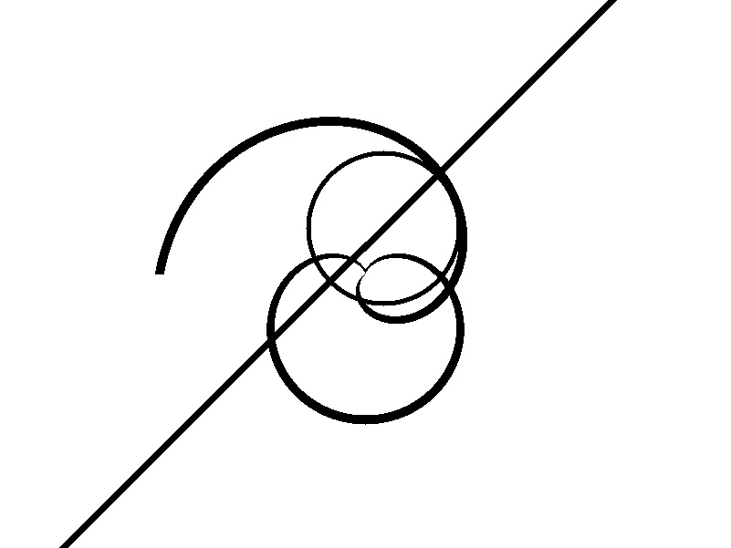

# Tested on Visual Studio 2015 Community with CUDA 8.0, Opencv 3.1

```
For general curves I don't want to list explanation here, just show you some interesting curves like heart curve, archimedean spiral.
```
- [Heart Curve](https://en.wikipedia.org/wiki/Cardioid)
- [Archimedean Spiral](https://en.wikipedia.org/wiki/Archimedean_spiral)

## Result

:boom::boom::boom::boom:

## Time Cost(Debug Mode):
```cpp
my computer cofiguration: ThinkPad T420 with I5-2520 and GPU NVS4200
Sameple image info: 801 * 601, 1-channels.
time cost on device: 15.68 ms. By the way, time cost contains these five curves running time.
```

## Tips
### This algorithm just implement for handle 1-channel image.
### And my Opencv path on my computer is ```C:\Program Files\opencv\install```

