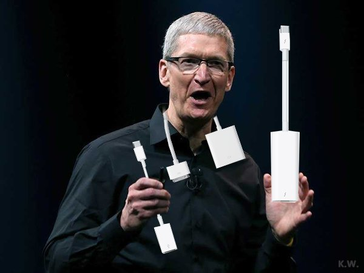

# Tested on Visual Studio 2015 Community with CUDA 8.0, Opencv 3.1

## For gaussian blur, see a wiki explanation.
[gaussian blur](https://en.wikipedia.org/wiki/Gaussian_blur)

## Result
original

blurred


## Time Cost:
```cpp
my computer cofiguration: ThinkPad T420 with I5-2520 and GPU NVS4200
Sameple image info: 600 * 450
time cost on device: 9.07ms
time cost on cpu: 116.167ms
Summary: GPU really gives a huge boost to handling image processing when comparing to cpu
```
### 

## Tips
### This algorithm just implement for handle 1-channel image.
### And my Opencv path on my computer is ```C:\Program Files\opencv\install```