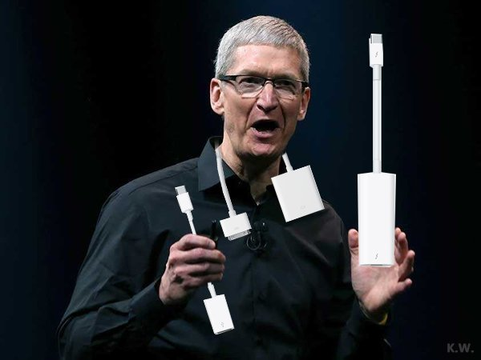
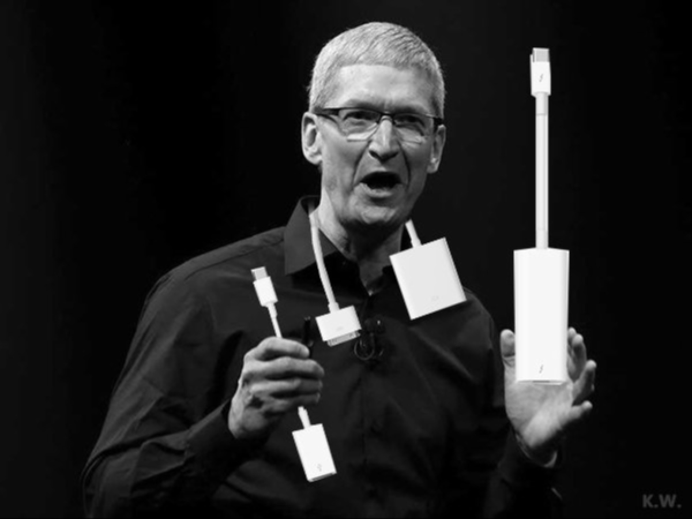

# Tested on Visual Studio 2015 Community with CUDA 8.0, Opencv 3.1

```
This is a simple algorithm to resize image, just see the wiki page, that's very detailed.
```
- [Bilinear Interpolation](https://en.wikipedia.org/wiki/Bilinear_interpolation)

## Result(non-anti-aliasing)

:boom::boom::boom::boom:


## Time Cost(Debug Mode):
```cpp
my computer cofiguration: ThinkPad T420 with I5-2520 and GPU NVS4200
Sameple image info: 801 * 601, 1-channels.
time cost on device: 14.547 ms.
time cost on cpu: 0.0345 ms.
Tip: This time, cpu api is faster than gpu implementation.
```

## Tips
### This algorithm just implement for handle 1-channel image.
### And my Opencv path on my computer is ```C:\Program Files\opencv\install```