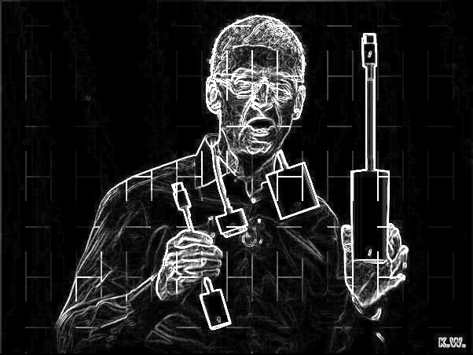

# Tested on Visual Studio 2015 Community with CUDA 8.0, Opencv 3.1

```
For sobel operator, see a wiki explanation. Usually this algorithm is for edge detecting.
```
[Sobel Operator](https://en.wikipedia.org/wiki/Sobel_operator)

```
gx=[-1, 0, 1;
    -2, 0, 2;
    -1, 0, 1]
gy=[1, 2, 1;
    0, 0, 0;
    -1, -2, -1]
```
If the source matrix is **A**, convolve **A** with **gx** to get matrix **GX**, actually which is a gradient matrix from **x-anxi**, and the same way to generate **GY**. Finally, **G** = |**GX**| + |**GY**|, this is convenient for computing instead of **G** = **sqrt(pow(**GX**, 2) + pow(**GY**, 2))**, of cause, you can use the last equation.

## Result

:boom::boom::boom::boom:


## Time Cost(Debug Mode):
```cpp
my computer cofiguration: ThinkPad T420 with I5-2520 and GPU NVS4200
Sameple image info: 600 * 450, 3-channels.
time cost on device: 9.07ms.
time cost on cpu: 116.167ms. Use opencv API.
Summary: GPU really gives a huge boost to handling image processing when comparing to cpu.
In release mode, it may be faster.
```
### 

## Tips
### This algorithm just implement for handle 1-channel image.
### And my Opencv path on my computer is ```C:\Program Files\opencv\install```